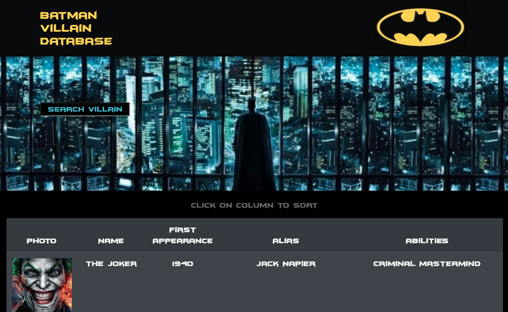
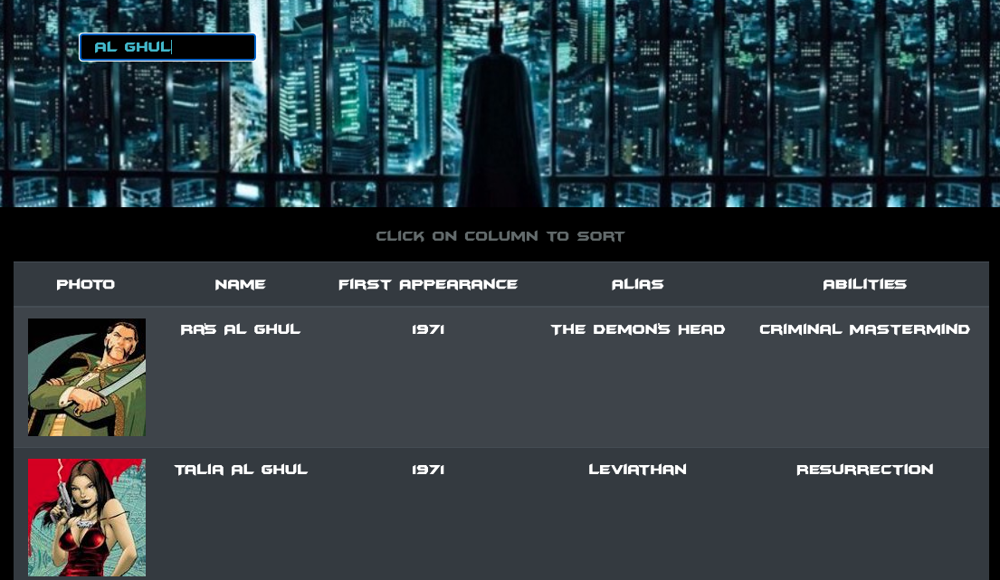
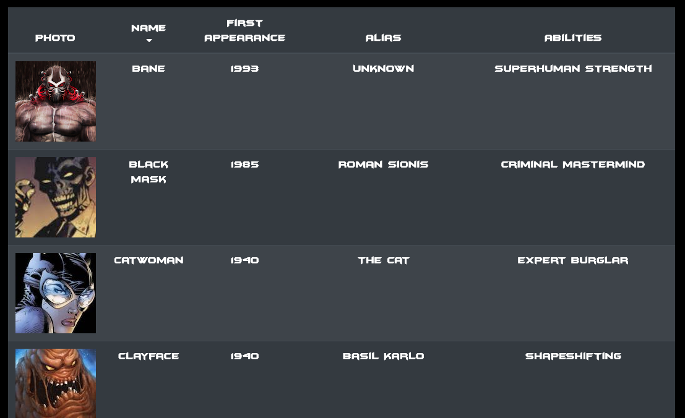
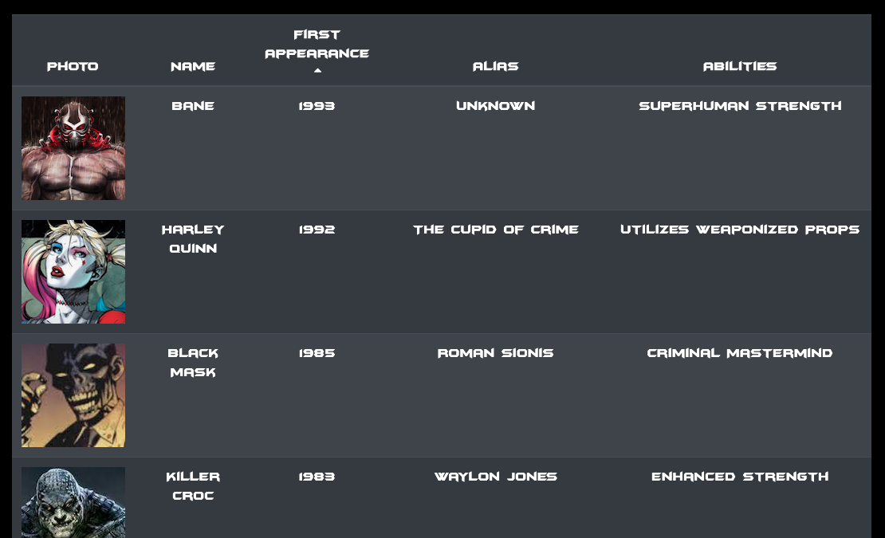
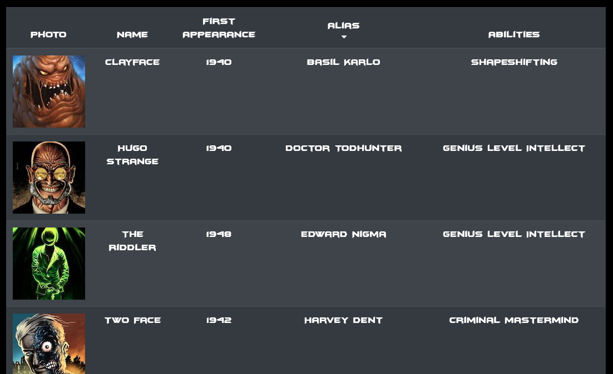
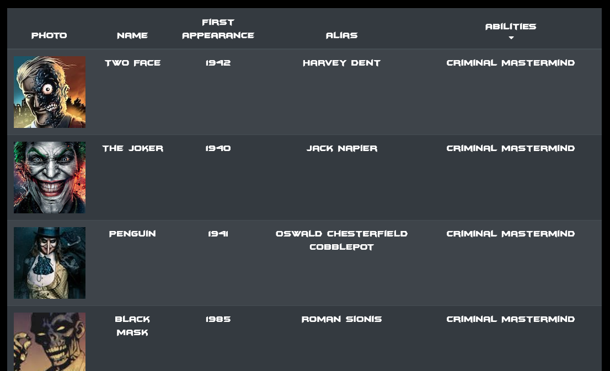

# Villain Directory

## About:
As internet speeds become faster and faster, long load times become increasingly evident to even the most basic of internet user. With older coding languages, it was common place to reload the entire DOM in order to re render even the most basic of changes. With the introduction of modern languages such as React, virtual DOMs are becoming more prevalent reducing load times. The virtual DOM re-renders only what is necessary on the page, in a modular sense. 

The Villain Directory App lets the user browse through Batman villains and their information. It utilizes React to render components, such as the header, search section, and table. It also passes functions and variables as props through its coding in order to modularize its code. As a result, the user can sort, and search the database with lightning fast speed.

## Index
1) [About](#About)
1) [Installation](#Installation)
2) [Usage](#Usage)
3) [Contributors](#Contributors)
4) [GitHub](#GitHub)

## Installation:
Run npm install

## Usage:
Visit the launched site at: https://akleiner26.github.io/Villain-Directory/
Visit the Repo At: https://github.com/akleiner26/Villain-Directory

## Contributors:
Andrew Kleiner

## GitHub Username:
akleiner26

## GitHub Profile:
https://github.com/akleiner26

## GitHub Photo:
 

## GitHub Email:
AndrewJKleiner@gmail.com

## Screenshots

### Entering The Site

